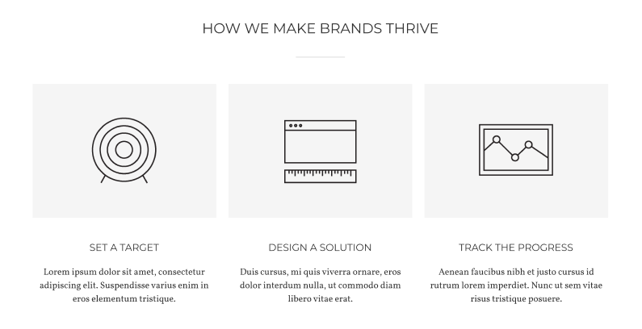
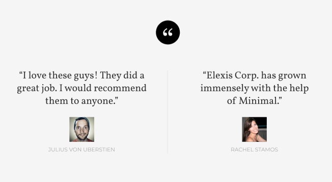
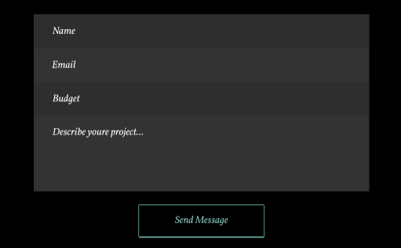

#Задание 1

Блоки: лицо, рука, нога
Элементы: шрам на руке, глаза на лице, браслет на руке
Модификаторы: материал браслета, цвет глаз, плоскостопие 


#Задание 2


```
header.header>div.header__wrapper>((ul.header__list>(li.header__item>a.header__logolink>img.header__logo)+(li.header__item>a.header__logolink>p.header__logotext))+(nav.header__navigation.navigation>ul.navigation__list>li.navigation__item*4>a.navigation__link))
```



```
.card>img.card_image+card__title+card__text
```



```
blockquote.quote>p.quote__text+figure.quote__caption>img.quote__avatar+figcaption.quote__author
```



```
form.form>(input.form__name+input.form__email+input.form__budget+input.form__text+input.form__send)
```
